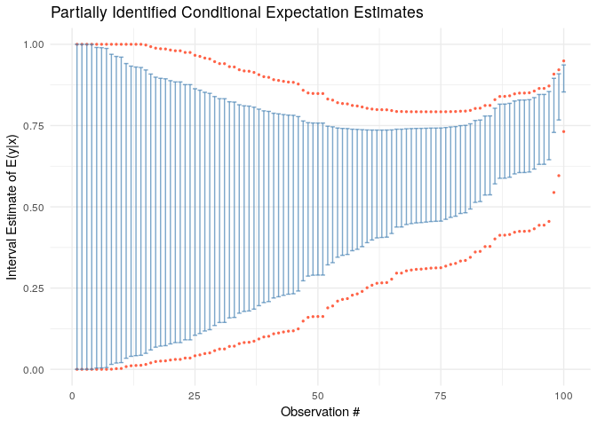

<!-- README.md is generated from README.Rmd. Please edit that file -->

# rbounds: Estimating Bounds on Partially Identified Parameters

The goal of rbounds is to estimate bounds on the location of parameters
in models in which the value of the parameter can only be partially
identified.

The package implements non-parametric bounds estimation following the
work of Charles Manski on partial identification. It uses kernel
regression estimators from the `np` package to estimate the identifiable
components of the bounds.

**Current functionality:**

1.  `pidoutcomes()`: Bounds on conditional means with missing outcomes
2.  `ate_bounds()`: Manski bounds on Average Treatment Effects (ATE)

## Example of bounding the conditional mean

Imagine that we are interested in estimating $E(y | x)$ where
$y \in \{0,1\}$. Unfortunately, we are missing some observations of $y$.
Whether an observation is missing is denoted by a dummy variable $z$,
where when $z=1$ $y$ is observed and otherwise the value of $y$ is not
observed. We have some covariates $x$ whose value we observe for all
observations.

By the law of total probability it follows that

$$E(y | x) = E(y | x, z = 1)P(z = 1 | x) + E(y | x, z = 0)P(z = 0 | x).$$

Each of the pieces of this equation can be estimated from the available
data with the exception of $E(y|x, z=0)$, which is the conditional
expectation of the outcome for the cases in which the outcome value is
unobserved.

However, since $0 \leq y \leq 1$, the unobserved function can take on
the value of at most $1$ – if all the unobserved outcomes were 1, or at
least $0$. Thus the true conditional mean must fall within the bounds:

$$E(y | x, z = 1)P(z = 1 | x) \leq E(y | x) \leq E(y | x, z = 1)P(z = 1 | x ) + (1 - P(z = 1 | x)).$$

More generically, if we denote the minimum value the conditional outcome
can take on as $\gamma_0$ and the maximum by $\gamma_1$, then the
conditional mean can be bounded by

$$E(y | x, z = 1)P(z = 1 | x) + \gamma_0 P(z=0|x) \leq E(y | x) \leq E(y | x, z = 1)P(z = 1 | x ) + \gamma_1 P(z = 0 | x).$$

The conditional expectations in these expressions can be estimated
parametrically or non-parametrically, and confidence intervals can be
derived for the locations of the endpoints.

## Example

Using simulated data we present a simple example of the `pidoutcomes()`
function which we use to estimate partially identified conditional
conditional means.

``` r
## We generate some fake data
library(rbounds)
set.seed(42)

N <- 100
x <- rnorm(N)
z <- rbinom(N, 1, pnorm(x))
y <- rbinom(N, 1, pnorm(x))

df <- data.frame(y, x, z)

res <- pidoutcomes(y~x, z, df)
#> Multistart 1 of 1 |Multistart 1 of 1 |Multistart 1 of 1 |Multistart 1 of 1 /Multistart 1 of 1 |Multistart 1 of 1 |                   Multistart 1 of 1 |Multistart 1 of 1 |Multistart 1 of 1 |Multistart 1 of 1 /Multistart 1 of 1 |Multistart 1 of 1 |                   
res
#> Av. Lower CI Av. Lower Bound Av. Upper Bound Av. Upper CI
#>    0.2969        0.30612         0.82252       0.83092

# We can plot it with a generic plotting method
plot(res)
```

<!-- -->

## Bounding Average Treatment Effects

The `ate_bounds()` function computes Manski worst-case bounds on the
Average Treatment Effect (ATE) when treatment assignment may be
non-random.

The ATE is $\tau = E[Y(1)] - E[Y(0)]$ where $Y(1)$ and $Y(0)$ are
potential outcomes. Since we only observe $Y(1)$ for treated units
(where $D=1$) and $Y(0)$ for control units (where $D=0$), the ATE is not
point-identified without assumptions.

By the law of iterated expectations:

$$E[Y(1)] = E[Y|D=1] \cdot P(D=1) + E[Y(1)|D=0] \cdot P(D=0)$$

The term $E[Y(1)|D=0]$ — the mean treated outcome for those who were not
treated — is unobservable. However, if outcomes are bounded
($Y \in [y_{min}, y_{max}]$), we can bound this term and thus bound
$E[Y(1)]$:

$$E[Y|D=1] \cdot P(D=1) + y_{min} \cdot P(D=0) \leq E[Y(1)] \leq E[Y|D=1] \cdot P(D=1) + y_{max} \cdot P(D=0)$$

Similarly for $E[Y(0)]$. The ATE bounds are then:

$$\tau^L = \left(E[Y|D=1] \cdot P(D=1) + y_{min} \cdot P(D=0)\right) - \left(y_{max} \cdot P(D=1) + E[Y|D=0] \cdot P(D=0)\right)$$

$$\tau^U = \left(E[Y|D=1] \cdot P(D=1) + y_{max} \cdot P(D=0)\right) - \left(y_{min} \cdot P(D=1) + E[Y|D=0] \cdot P(D=0)\right)$$

### ATE Example

``` r
# Simulate data with selection into treatment
set.seed(123)
N <- 200
x <- rnorm(N)

# Treatment depends on x (selection)
d <- rbinom(N, 1, pnorm(0.5 * x))

# Potential outcomes
y0 <- rbinom(N, 1, pnorm(-0.3 + 0.3 * x))
y1 <- rbinom(N, 1, pnorm(0.3 + 0.3 * x))

# Observed outcome
y <- d * y1 + (1 - d) * y0
df <- data.frame(y = y, x = x, d = d)

# True ATE (in this simulation we can compute it)
true_ate <- mean(y1 - y0)
cat("True ATE:", round(true_ate, 3), "\n")
#> True ATE: 0.19

# Estimate ATE bounds
ate_res <- ate_bounds(y ~ x, treatment = d, data = df)
#> Multistart 1 of 1 |Multistart 1 of 1 |Multistart 1 of 1 |Multistart 1 of 1 /Multistart 1 of 1 |Multistart 1 of 1 |                   Multistart 1 of 1 |Multistart 1 of 1 |Multistart 1 of 1 |Multistart 1 of 1 /Multistart 1 of 1 |Multistart 1 of 1 |                   Multistart 1 of 1 |Multistart 1 of 1 |Multistart 1 of 1 |Multistart 1 of 1 /Multistart 1 of 1 |Multistart 1 of 1 |                   
ate_res
#> Manski Bounds on Average Treatment Effect
#> ==========================================
#> 
#> ATE bounds:     [-0.4341,  0.5659]
#> 95% CI:         [-0.4418,  0.5730]
#> 
#> Outcome range:  [0, 1]
#> Observations:   200
#> Mean propensity: 0.508

# Plot CATE bounds
plot(ate_res)
```

<!-- -->
